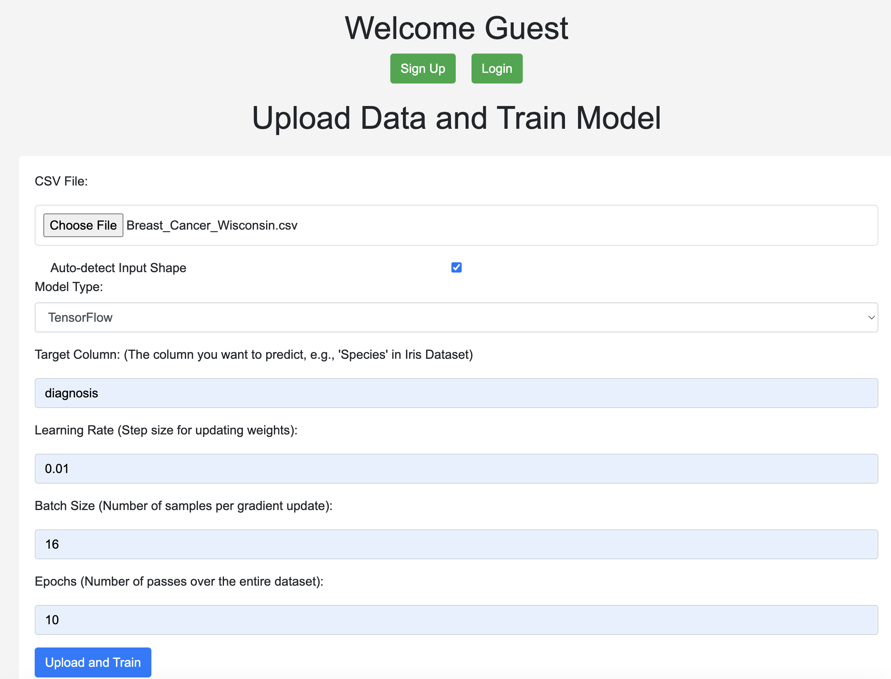
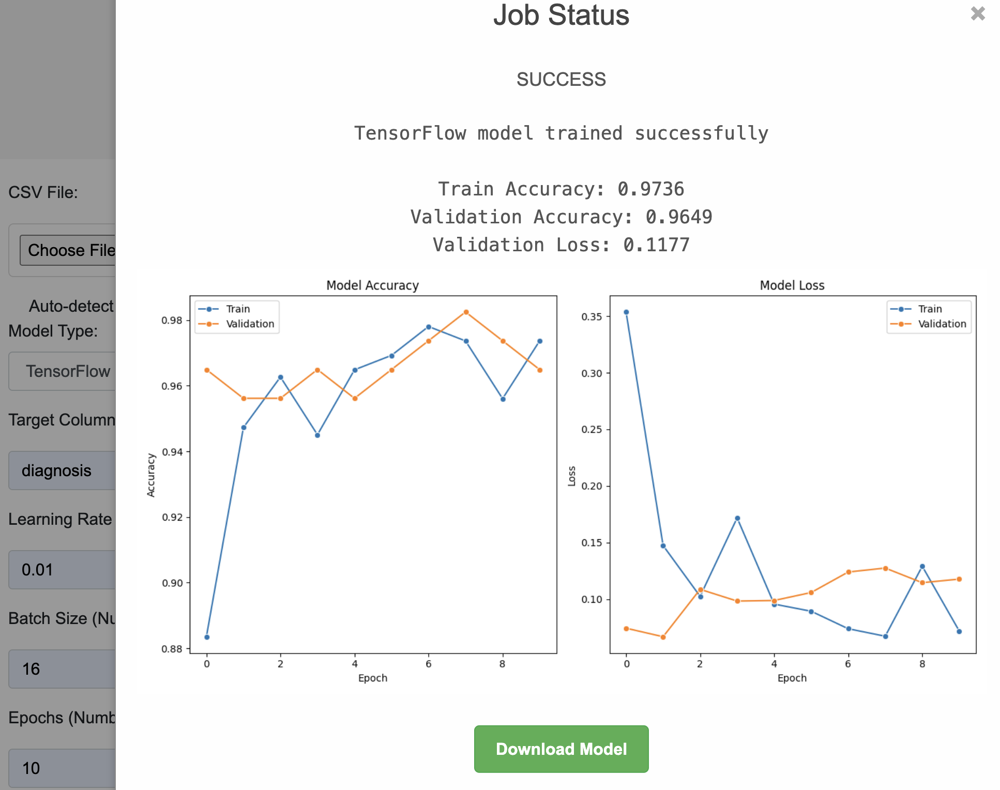

# DistributedCluster MLTrainer

THis is a Machine Learning Model Trainer project I designed for training machine learning models across distributed systems. This project uses ML and Data Analysis Libraries, Docker, Flask, Celery, Redis, Auth0 alongside popular machine learning libraries like PyTorch, TensorFlow, and scikit-learn for a scalable and user-friendly ML model training platform.

## Screenshots

### Homepage

### Model Training Page

## Tech Stack

- **Flask**: Serves the web interface for dataset uploads and training configuration.
- **Celery**: Manages asynchronous task queues for model training.
- **Redis**: Acts as the message broker for Celery.
- **Docker**: Ensures environment consistency and simplifies deployment.
- **Machine Learning Libraries**: Includes PyTorch, TensorFlow, and scikit-learn for model training capabilities.
- **Data Analysis Libraries**: Utilizes `numpy` and `pandas` for data manipulation and preprocessing datasets.
- **Visualization Libraries**: `Matplotlib` & `Seaborn` are used for generating training plots to visualize model performance.
- **Auth0**: Provides secure user authentication and registration.

## Key Features

- **User Authentication**: Secure signup and login functionality.
- **Flexible Model Training**: Train models using PyTorch, TensorFlow, or scikit-learn with customizable parameters.
- **Dataset Management**: Upload datasets in CSV format and specify target columns for predictions.
- **Distributed Processing**: Utilizes Celery workers for scalable model training tasks.
- **Interactive Feedback**: Provides real-time updates on training progress and model download capabilities.

## Getting Started

### Prerequisites

- Docker
- Docker Compose

### Installation

1. Clone the repository:

git clone https://github.com/heming277/DistributedCluster_MLTrainer.git

2. Navigate to the project directory:

cd DistributedCluster_MLTrainer

3. Create a `.env` file in the project root with the following variables (replace placeholders with your actual values):
   - `AUTH0_BASE_URL='http://localhost:5000'`
   - `AUTH0_CALLBACK_URL='http://localhost:5000/callback'`
   - `AUTH0_CLIENT_ID='your_auth0_client_id'`
   - `AUTH0_CLIENT_SECRET='your_auth0_client_secret'`
   - `AUTH0_DOMAIN='your_auth0_domain'`
   - `APP_SECRET_KEY='your_app_secret_key'`
   - `CELERY_BROKER_URL='redis://redis:6379/0'`
   - `CELERY_RESULT_BACKEND='redis://redis:6379/0'`

   Note: If you do not wish to use authentication, you can ignore the Auth0 variables.

3. Build and run the Docker containers:

docker-compose up --build

### Usage

1. **Access the Web Interface**: Open `http://localhost:5000` in your browser.
2. **Upload a Dataset**: Click on "Upload Data and Train Model", select your CSV dataset, and fill in the required fields.
3. **Train the Model**: Choose the ML library and set the parameters for your model. Click "Upload and Train" to start the training process.

## Example Datasets

- Iris Dataset: Classify iris species.
- Wine Quality Dataset: Predict wine quality from physicochemical properties.
- Breast Cancer Wisconsin Dataset: Diagnose breast cancer.

## Future Enhancements

- **Model Support Expansion**: Integrate more ML libraries and models.
- **UI/UX Improvements**: Enhance the web interface for a better user experience.
- **Advanced Analytics**: Implement detailed analytics for training performance.

## Contributing

Contributions are welcome! Please fork the repository and submit pull requests with your proposed changes.

## License

This project is licensed under the MIT License - see the [LICENSE](LICENSE) file for details.

---